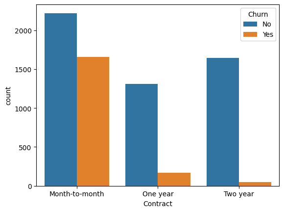
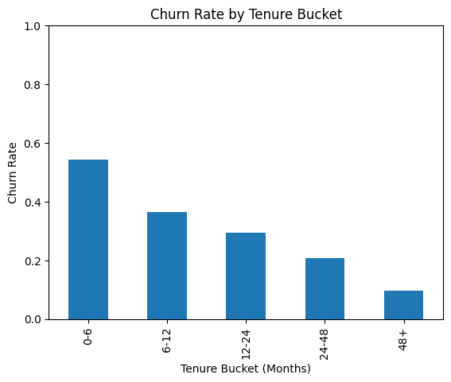
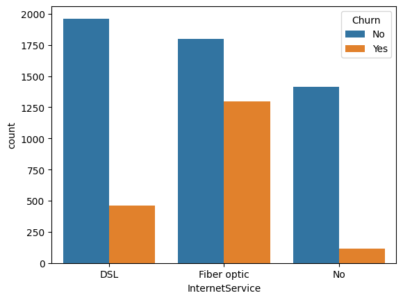
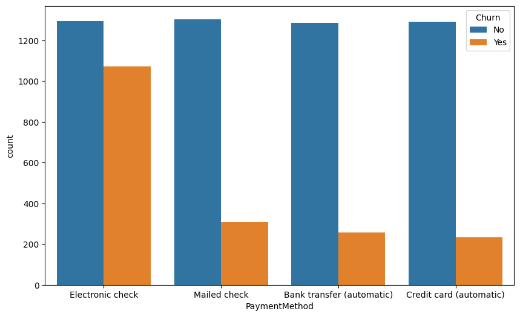
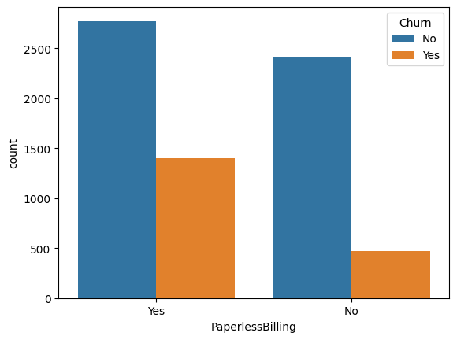
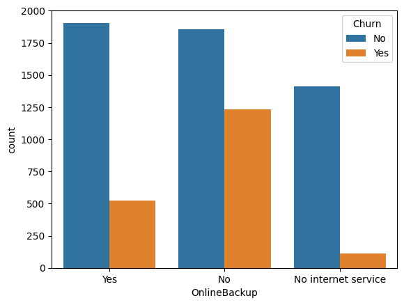

# Appendix — High-Signal Charts

### 1️⃣ Churn Rate by Contract Type

- Month-to-month contracts have the highest churn.
- 2-year contracts have the lowest churn.

---

### 2️⃣ Churn Rate by Tenure Bucket

- Early-tenure customers (0–6 months) churn the most.
- Churn rate declines as tenure increases.

---

### 3️⃣ Monthly Charges Distribution (Churn vs No Churn)

- Higher monthly charges are associated with increased churn.

---

### 4️⃣ Internet Service vs Churn

- Fiber optic users churn more compared to DSL or no internet.

---

### 5️⃣ Add-on Services vs Churn

- Customers with services like TechSupport or OnlineBackup are less likely to churn.

---

### 6️⃣ Payment Method vs Churn

- Electronic check users have the highest churn rate.

---

### 7️⃣ Paperless Billing vs Churn

- Customers with paperless billing have slightly higher churn.

---

### 8️⃣ Tenure Bucket × Contract Type

- Early-tenure churn is mostly among month-to-month customers.
- Longer contracts reduce churn in higher tenure buckets.

### 9️⃣ Online Backup vs Churn

- Customers without Online Backup have a higher churn rate.  
- Offering Online Backup appears to help reduce churn risk.
